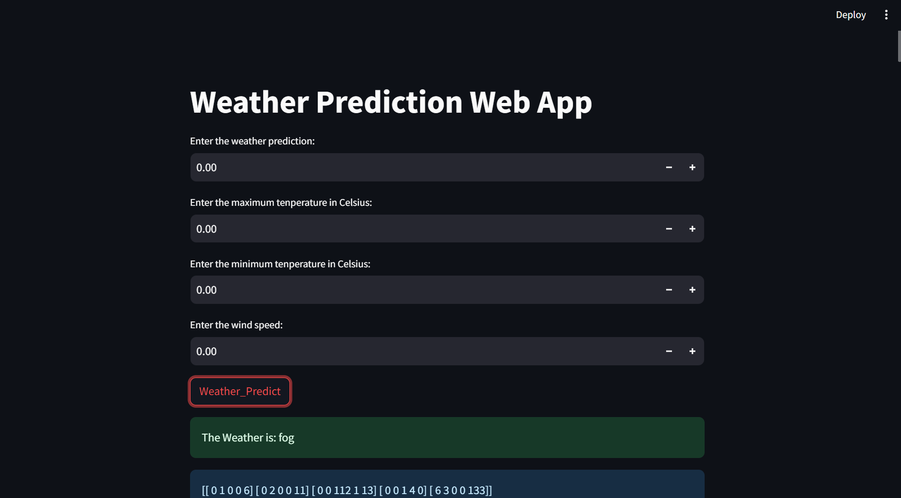

## Table of contents
* [Project Information](#Project_Information)
* [Technologies](#technologies)
* [Setup](#setup)

## Project_Information
This project is simple Weather Prediction System Web Application.
The files like app.py and bmi.py is our learning of streamlit framework you can ignore if you know the streamlit framework basics concepts.
	
## Technologies
Project is created with:
* Python : Python 3.12.0
* Streamlit Framework : Streamlit, version 1.29.0
* Machine Learning Model.
	
## Setup
1] To run this project, firstly create a virtual environment 
```
virtualenv env
```
It will create an env folder which will allow to install the packages or modules.

2] To activate virtual environment use following command
```
cd env
Script\activate
```
3]Install the following packages needed for the project which are as follow:
* Streamlit-> install pandas,numpy by default so you don't need to install seperately
* Scikit-learn
If you face issue like UserWarning: FigureCanvasAgg is non-interactive
* pip install PyQt6 (it solved the issue of displaying of the data visualization from my part) and also add this code import matplotlib
matplotlib.use('TkAgg')

Installation packages
```
pip install Streamlit
pip install Scikit-learn
pip install PyQt6 
```



